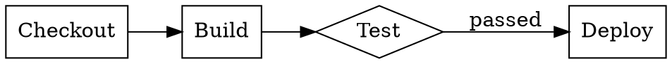

<h1 align="center">dot.mq</h1>

A [Graphviz DOT](https://graphviz.org/doc/info/lang.html) language parser implemented as an [mq](https://github.com/harehare/mq) module.

## Features

- Parse `graph` and `digraph` definitions
- Node definitions with attribute dicts
- Edge definitions (`->` and `--`) with optional labels
- Graph-level, node-level, and edge-level `[attr]` blocks
- `strict` keyword support
- Source node detection for digraphs
- Serialize parsed graph objects back to DOT strings

## Installation

```sh
cp dot.mq ~/.local/mq/config/
```

### HTTP Import (no local installation needed)

If `mq` was built with the `http-import` feature, you can import directly from GitHub without any local setup. This requires the `--allow-http-import` flag, which is disabled by default:

```sh
mq --allow-http-import -I raw 'import "github.com/harehare/dot.mq" | dot::dot_parse(.)' graph.dot
```

Pin to a specific release with `@vX.Y.Z`:

```sh
mq --allow-http-import -I raw 'import "github.com/harehare/dot.mq@v1.0.0" | dot::dot_parse(.)' graph.dot
```

## API

| Function | Description |
|---|---|
| `dot_parse(input)` | Parse DOT source, return `{ type, name, strict, nodes, edges, attrs }` |
| `dot_is_directed(input)` | Returns `true` for `digraph` |
| `dot_sources(input)` | Returns nodes with no incoming edges |
| `dot_stringify(g)` | Serialize a parsed graph object back to a DOT string |

## Example

Given `pipeline.dot`:



```sh
# Get all node labels
mq -I raw 'iimport "dot" | dot::dot_parse(.)mport "dot" | dot::dot_parse(.) | ."nodes" | map(fn(n): n["attrs"]["label"];)' pipeline.dot
# => ["Checkout", "Build", "Test", "Deploy"]

# Get edges with labels
mq -I raw 'import "dot" | dot::dot_parse(.) | ."edges" | filter(fn(e): len(e["attrs"]["label"]) > 0;)' pipeline.dot
# => [{"from":"test","to":"deploy","attrs":{"label":"passed"}}]

# Find entry-point nodes
mq -I raw 'import "dot" | dot::dot_sources(.) | map(fn(n): n["id"];)' pipeline.dot
# => ["checkout"]

# Count nodes and edges
mq -I raw 'import "dot" | dot::dot_parse(.) | {"nodes": len(."nodes"), "edges": len(."edges")}' pipeline.dot
# => {"nodes":4,"edges":4}

# Round-trip: parse then re-serialize
mq -I raw 'import "dot" | dot::dot_parse(.) | dot::dot_stringify(.)' pipeline.dot
# => digraph pipeline {
#      graph [rankdir=LR]
#      checkout [label="Checkout" shape=box]
#      ...
#    }

# Transform: rename a node then serialize back to DOT
mq -I raw 'import "dot" | dot::dot_parse(.) | set(., "nodes", map(."nodes", fn(n): if (n["id"] == "deploy"): set(n, "id", "release") else: n;)) | dot::dot_stringify(.)' pipeline.dot
```

## License

MIT
